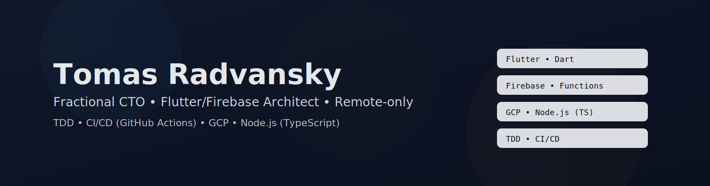

<div align="center">
  
</div>

<h1 align="center">Hi, I'm Tomas Radvansky</h1>

<p align="center">
  Remote-only Fractional CTO specializing in Flutter, Firebase, and Node.js (TS).  
  I build scalable mobile apps, solid architectures, and CI/CD pipelines for  
  greenfield startups. TDD-first, GCP-native, and passionate about scientific  
  and meaningful products.
</p>

<p align="center">
  <a href="mailto:radvansky.tomas@gmail.com"></a>
  <a href="https://www.linkedin.com/in/tomas-radvansky-7380265a"></a>
  <a href="https://github.com/radvansky-tomas"></a>
  <a href="https://github.com/rdev-software"></a>
</p>

---

### 👋 About me
- 🇸🇰 Slovak living in Northland, New Zealand (PR)
- 💼 **Fractional / Temp CTO** for greenfield startups
- 🧪 TDD-first, writing unit & integration tests
- 🧑‍💻 Remote-only (no office, no relocation)
- ☁️ GCP + Firebase + Node.js (TS) Functions
- 🔧 CI/CD with GitHub Actions
- 💚 I love meaningful, science-oriented projects
- 💬 Admin for **Firebase Support** Slack

### 🛠️ Tech I use daily
<p>
  
  
  
  
  
  
  
  
</p>

### 🚀 Featured projects
- **Backyard Hunt** — QR-code based treasure/scavenger hunts for kids  
  🔗 https://backyard-hunt.com  
- **Click Defeat** — Idle button-smashing time trials for couples/friends  
  🔗 https://click-defeat.com

### 🧭 What I do as a Fractional CTO
- Design **mobile + backend** greenfield stacks (Flutter + Firebase + Functions)
- Establish **quality gates** and test strategies
- Build **CI/CD pipelines** (build, test, release)
- Architect secure multi-env Firebase setups
- Mentor teams on architecture, clarity, and delivery cadence

### 🗺️ Typical architecture
```mermaid
graph LR
  A[Flutter App (iOS/Android/Web)] --> B[Firebase Auth]
  A --> C[Firestore / RTDB]
  A --> D[Storage]
  C --> E[Cloud Functions (Node.js / TS)]
  E --> F[GCP Services]
  G[GitHub Actions] -->|Build/Test| A
  G -->|Deploy Functions| E
  G -->|Rules/Configs| C
